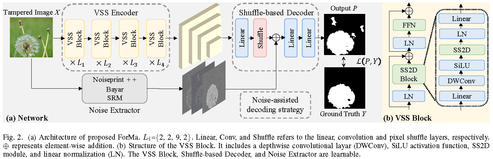

## A Lightweight and Effective Image Tampering Localization Network with Vision Mamba
An official implementation code for paper "[A Lightweight and Effective Image Tampering Localization Network with Vision Mamba](https://arxiv.org/abs/2502.09941)". This repo provide codes and trained weights.
## Framework
<p align='center'>  
  
</p>

## Dependency
- torch 1.13.1+cu117
- torchvision 0.14.1+cu117
- python 3.10
- causal-conv1d 1.0.0
- mamba-ssm 1.0.1
- selective_scan 0.0.2

## Usage
For example to train:
```
python generate_npy.py
python train.py 
```

For example to test:
download [ForMa.pth](https://pan.baidu.com/s/1A8DrM4KD5iz5bKFAN5XFdw?pwd=1234) and place it in the `weights/` directory. 
```
python generate_npy.py
python test.py 
```

## Citation
If you use this code for your research, please cite our paper
```
@article{guo2025light,
  title={A Lightweight and Effective Image Tampering Localization Network with Vision Mamba},
  author={Guo, Kun and Cao Gang and Lou, Zijie and Huang, Xianglin and Liu, Jiaoyun},
  journal={IEEE Signal Processing Letters},
  year={2025}
}
```

